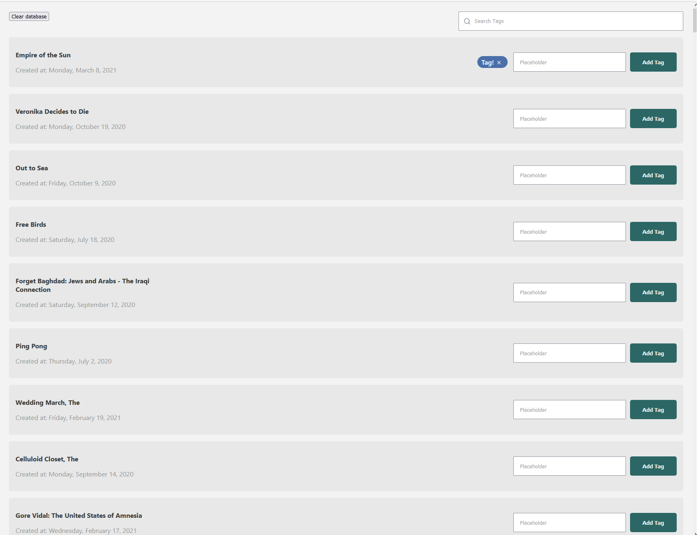

# SEDNA assessment

Challenge: Create an app that allows a user to save tags for items in a single page list.

## Requirements

- An item can have a maximum of 5 tags and should be removable, but not editable.
- Each item in the list should display at least the name of the item and date.
- Tags should be persisted so that the tags remain across browser sessions.
- The list should also be filterable by user defined tags through a simple search.
- You must create the UI components yourself and avoid usage of third party libraries such as Material UI or Reactstrap, however you may use any additional open source libraries you need.
- You may use any icon set you wish to use.

## How To Run

After cloning the repository, run `npm install`. When finished, run `npm start`. A new browser tab should open at `localhost:3000` to view the project.

Note: Please make sure your node is on the [LTS version](https://nodejs.org/en/) in order to be able to run this project.

I added a 'Clear Database' button in order to be able to test if the data persists after refresh.

## Libraries/Tools used

1. [Dexie](https://dexie.org/) - In order to be able to persist tags across browser sessions with IndexedDB, I used this wrapper to take advantage of its concise API.
2. [Emotion](https://emotion.sh/docs/introduction) - For styling the components
3. [Feather Icons](https://feathericons.com/) - Used for the search and remove icons
4. [Axios](https://www.npmjs.com/package/axios) - For http requests
5. [Create React App](https://create-react-app.dev/) - To quickly setup this project
